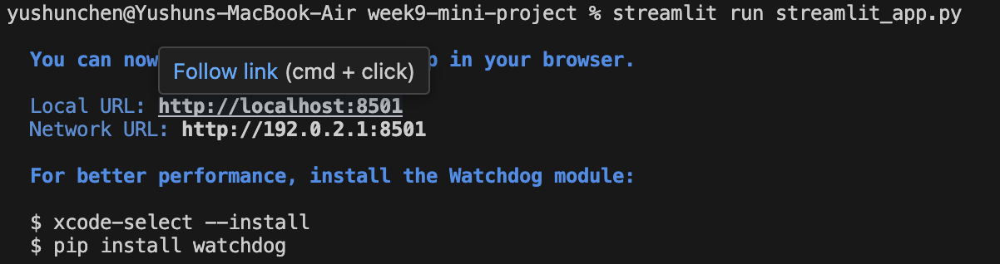
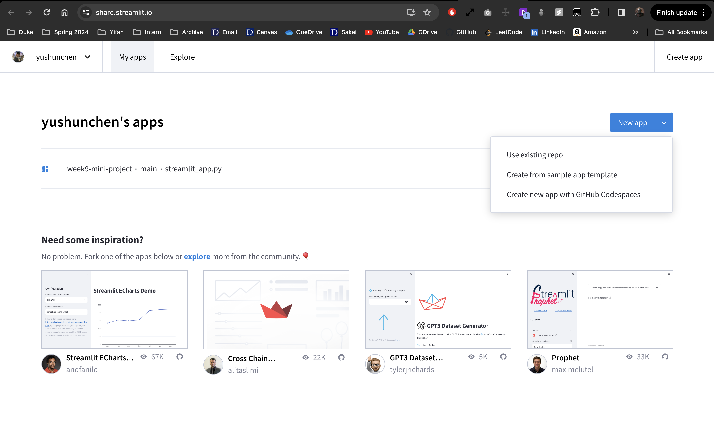
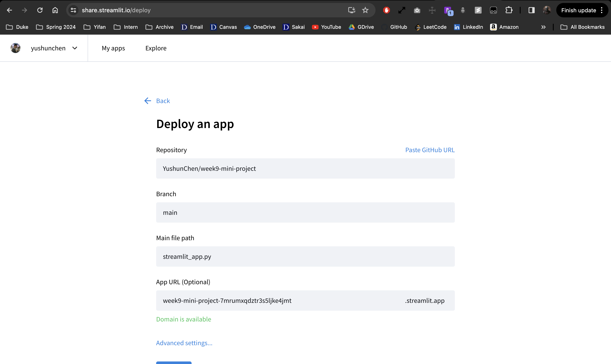
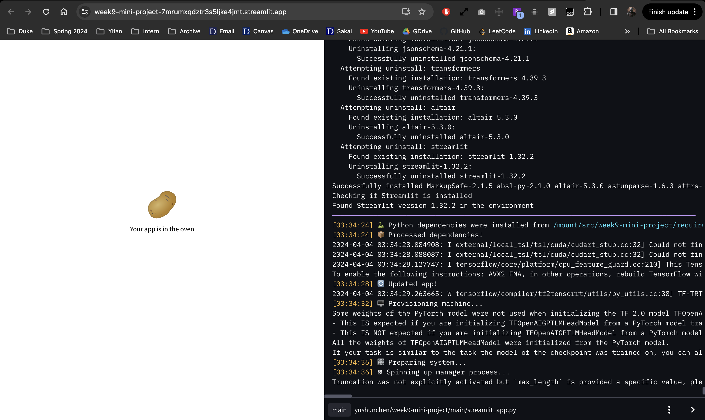
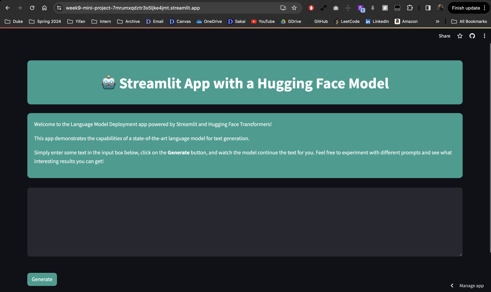

# Week 9 Mini Project
> Oliver Chen (yc557)

```bash
pip3 install -r requirements.txt
```

## Project Introduction
This project intends to create a website using Streamlit, connect to an open source LLM (Hugging Face), and deploy model via Streamlit  that can be accessed by anyone via browser.

## Project Setup
### Streamlit Setup
1. Create an empty Git repository for the project.
2. Set up Python development environment.
3. Run the following command to install Streamlit:
```bash
pip install streamlit
```
4. Validate the installation by running a Hello app:
```bash
streamlit hello
```

### Packages Required
1. Create a `requirements.txt` file in the Python project.
2. Add the following requirements:
```txt
streamlit 
transformers
tensorflow
tf-keras
```
3. Run the follow command to install the packages:
```bash
pip install -r requirements.txt
```
### Implement Streamlit Web Application
The detailed implementation is in `streamlit_app.py`, which can be accessed [here](./streamlit_app.py).

### Test Locally
1. Run the following command to test the application locally.
```bash
streamlit run streamlit_app.py
```
2. Access the web application at the local URL: http://localhost:8501
Here is what I had:


## Project Deployment on Streamlit

1. Create an account and signin to https://streamlit.io/.
2. Under https://share.streamlit.io/, create a new app **using existing repo**.

3. Make sure the repo, branch, and application file are correct. 

4. Then deploy. You can access the logs while the app is being deployed.

5. After the deployment is successful, the Streamlit application can be accessed using this URL: https://week9-mini-project-7mrumxqdztr3s5ljke4jmt.streamlit.app/.


## Demo Video
You can access the demo video [here](./images/demo.mp4).